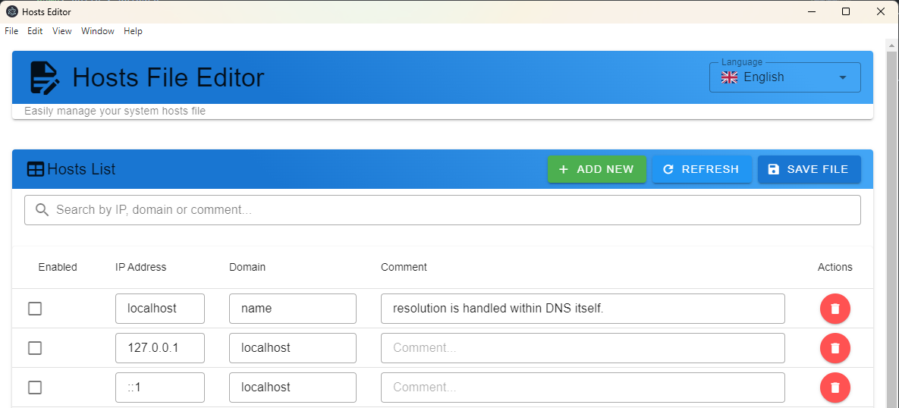

# Electron Vue Hosts Editor

[](https://github.com/vdhoangson)
[](https://opensource.org/licenses/MIT)
[](https://nodejs.org/)
[](https://electronjs.org/)
[](https://vuejs.org/)
[](https://vuetifyjs.com/)

A modern hosts file editor built with Electron, Vue 3, and Vuetify.

## 🚀 Quick Start

### Download

Download the latest release for your platform from the [Releases](https://github.com/vdhoangson/electron-vue-hosts-editor/releases) page.

### Installation

1. Download the installer for your operating system
2. Run the installer and follow the setup wizard
3. Launch the application from your applications menu

### System Requirements

- **Windows**: Windows 10 or later
- **macOS**: macOS 10.13 or later
- **Linux**: Ubuntu 18.04+, Fedora 30+, or equivalent

## Features

- 🖥️ **Modern UI**: Clean, responsive interface built with Vuetify 3
- 🌐 **Multi-language Support**: Vietnamese and English with persistent language selection
- 📝 **Easy Editing**: Table-based interface for managing hosts entries
- 🔍 **Search & Filter**: Real-time search across IP addresses, domains, and comments
- 💾 **Auto-save**: Changes are saved with admin privileges when needed
- 🔔 **Notifications**: Toast notifications for all operations
- 🎨 **Dark/Light Theme**: Modern Material Design components

## 📖 Usage

### Basic Operations

1. **Add Entry**: Click the "+" button to add a new hosts entry
2. **Edit Entry**: Click directly on any cell to edit IP, domain, or comment
3. **Enable/Disable**: Use the checkbox to enable or disable entries
4. **Delete Entry**: Select an entry and use the delete functionality
5. **Search**: Use the search bar to filter entries in real-time

### Language Selection

- Click the language selector in the top-right corner
- Choose between Vietnamese (🇻🇳) and English (🇺🇸)
- Your selection is automatically saved and restored on next launch

### Saving Changes

- Changes are automatically saved when you click the "Save" button
- The application may request administrator privileges to modify the hosts file
- Success/error notifications will appear for all save operations

### Loading Hosts File

- The application automatically loads your system's hosts file on startup
- Use the "Refresh" button to reload the hosts file manually
- Any external changes to the hosts file will be detected and can be reloaded

## 📋 About Hosts File

The hosts file is a plain text file used by your operating system to map hostnames to IP addresses. Common uses include:

- **Development**: Redirect local development domains
- **Testing**: Block or redirect unwanted domains
- **Security**: Override DNS for malicious sites
- **Privacy**: Block tracking domains

### Hosts File Locations

- **Windows**: `C:\Windows\System32\drivers\etc\hosts`
- **macOS**: `/etc/hosts`
- **Linux**: `/etc/hosts`

### Best Practices

- Always backup your hosts file before making changes
- Use comments (#) to document your entries
- Test changes by pinging domains or using browser developer tools
- Be cautious with wildcard entries as they can cause issues

## Screenshots

### Main Interface



_The main interface showing the hosts file editor with search functionality, language selector, and data table._

## Development

### Prerequisites

- Node.js 16+
- Yarn package manager

### Setup

```bash
# Install dependencies
yarn install

# Start development server
yarn dev

# Build for production
yarn build
```

### Available Scripts

```bash
# Development
yarn dev              # Start both renderer and electron
yarn dev:renderer     # Start Vite dev server only
yarn dev:electron     # Start Electron only

# Production
yarn build           # Build and package application
yarn start           # Run built application

# Code Quality
yarn format           # Format code with Prettier
yarn format:check     # Check code formatting
yarn lint             # Lint code with ESLint
yarn lint:fix         # Fix linting issues automatically
```

## Code Formatting

This project uses **Prettier** for consistent code formatting:

- **JavaScript/Vue**: 2 spaces indentation, single quotes, no semicolons
- **JSON**: Consistent formatting
- **SCSS**: Auto-formatted with CSS sensitivity
- **Markdown**: Standard formatting

### Prettier Configuration

- Semi-colons: Disabled
- Single quotes: Enabled
- Tab width: 2 spaces
- Print width: 100 characters
- Trailing commas: ES5 style

Run `yarn format` before committing to ensure consistent code style.

## Language Support

The application supports Vietnamese and English languages:

- **Automatic Language Detection**: Loads the last selected language on startup
- **Persistent Settings**: Language preference is saved to localStorage
- **Easy Switching**: Language selector in the application header

### Supported Languages

- 🇻🇳 **Tiếng Việt** (Vietnamese)
- 🇺🇸 **English**

## Build Output

After running `yarn build`, the packaged application will be available in the `release/` directory:

- **Windows**: `release/win-unpacked/HostsEditor.exe`
- **macOS**: `release/HostsEditor.dmg`
- **Linux**: `release/HostsEditor.AppImage`

## Project Structure

```
electron-vue-hosts-editor/
├── .github/
│   └── FUNDING.yml              # GitHub Sponsors configuration
├── build/
│   └── icons/                   # Application icons for different platforms
├── screenshot/
│   └── screenshot.png           # Application screenshot
├── src/
│   ├── components/
│   │   ├── layout/
│   │   │   └── AppHeader.vue    # Header with language selector
│   │   ├── HostsDataTable.vue   # Main data table component
│   │   ├── LanguageSelector.vue # Language selection component
│   │   └── NotificationSnackbar.vue # Toast notifications
│   ├── composables/
│   │   ├── useLanguage.js       # Language management composable
│   │   └── useNotification.js   # Notification management
│   ├── config/
│   │   ├── i18n.js              # i18n configuration
│   │   └── vuetify.js           # Vuetify configuration
│   ├── constants/
│   │   └── menu.js              # Application menu configuration
│   ├── locales/                 # Translation files
│   │   ├── en.json              # English translations
│   │   └── vi.json              # Vietnamese translations
│   ├── assets/
│   │   └── app.scss             # Global styles
│   ├── App.vue                  # Main application component
│   └── app.js                   # Application entry point
├── dist/                        # Built application (generated)
├── release/                     # Packaged applications (generated)
├── main.js                      # Electron main process
├── preload.js                   # Electron preload script
├── hosts.js                     # Hosts file utilities
├── index.html                   # Main HTML template
├── vite.config.js               # Vite configuration
├── package.json                 # Project dependencies and scripts
└── README.md                    # This file
```

## Technology Stack

- **Frontend**: Vue 3 (Composition API), Vuetify 3
- **Backend**: Electron, Node.js
- **Build**: Vite, Electron Builder
- **Styling**: SCSS, Material Design
- **Internationalization**: Vue i18n
- **Code Quality**: Prettier, ESLint

## Support the Project

If you find this project helpful, consider supporting its development:

### 💝 Sponsorship

You can sponsor this project through [GitHub Sponsors](https://github.com/sponsors/vdhoangson):

[](https://github.com/sponsors/vdhoangson)

### ☕ Buy Me a Coffee

Support ongoing development with a coffee:

[](https://buymeacoffee.com/vdhoangson)

### 💰 Other Ways to Contribute

- ⭐ **Star the repository** if you find it useful
- 🐛 **Report bugs** and suggest features via [GitHub Issues](https://github.com/vdhoangson/electron-vue-hosts-editor/issues)
- 🔧 **Submit pull requests** for improvements
- 📢 **Share** the project with others who might benefit

Your support helps maintain and improve this open-source project! 🚀

## 🤝 Contributing

We welcome contributions! Please feel free to submit a Pull Request. For major changes, please open an issue first to discuss what you would like to change.

### Development Setup

1. Fork the repository
2. Clone your fork: `git clone https://github.com/your-username/electron-vue-hosts-editor.git`
3. Install dependencies: `yarn install`
4. Start development: `yarn dev`
5. Make your changes
6. Run tests and linting: `yarn lint && yarn format:check`
7. Submit a pull request

### Guidelines

- Follow the existing code style
- Add tests for new features
- Update documentation as needed
- Ensure all tests pass
- Use conventional commit messages

## 📄 License

This project is licensed under the MIT License - see the [LICENSE](LICENSE) file for details.

## 🙏 Acknowledgments

- [Electron](https://electronjs.org/) - Cross-platform desktop app framework
- [Vue.js](https://vuejs.org/) - Progressive JavaScript framework
- [Vuetify](https://vuetifyjs.com/) - Material Design component framework
- [Vite](https://vitejs.dev/) - Fast build tool and dev server

---

**Made with ❤️ by [vdhoangson](https://github.com/vdhoangson)**
